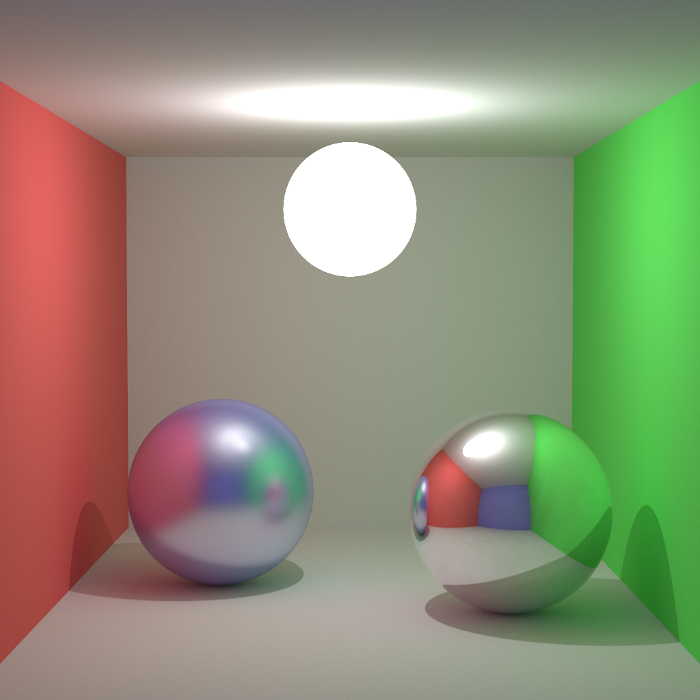

## :lizard: :trident: **zigzag**

[![CI][ci-shield]][ci-url]
[![License][license-shield]][license-url]

### Multi-threaded CPU path tracer.

#### :rocket: Usage

```sh
git clone https://github.com/tensorush/zigzag
cd zigzag/
zig build exe
```

#### :framed_picture: Render

<h4 align="center">
    <p>1024x1024 pixels with 256 samples per pixel and 8x SSAA</p>
</h4>

<p align="center">
    
</p>

<!-- MARKDOWN LINKS -->

[ci-shield]: https://img.shields.io/github/actions/workflow/status/tensorush/zigzag/ci.yaml?branch=main&style=for-the-badge&logo=github&label=CI&labelColor=black
[ci-url]: https://github.com/tensorush/zigzag/blob/main/.github/workflows/ci.yaml
[license-shield]: https://img.shields.io/github/license/tensorush/zigzag.svg?style=for-the-badge&labelColor=black
[license-url]: https://github.com/tensorush/zigzag/blob/main/LICENSE.md
