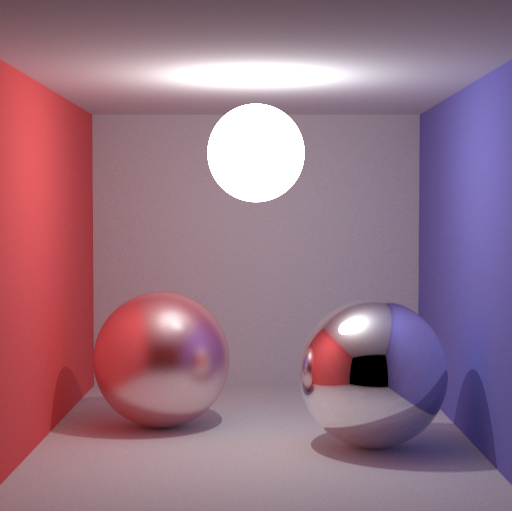

# :zap: :trident: **Zigzag**

[![CI][ci-shield]][ci-url]
[![License][license-shield]][license-url]
[![Resources][resources-shield]][resources-url]

    

<h4 align="center">
    
Result at 512x512 resolution with 256 samples per pixel and 8x SSAA

</h4>

## :sparkler: Multi-threaded CPU path tracer.

<!-- MARKDOWN LINKS -->

[ci-shield]: https://img.shields.io/github/workflow/status/tensorush/Zigzag/CI?style=for-the-badge&logo=github&label=CI&labelColor=black
[ci-url]: https://github.com/tensorush/Zigzag/blob/master/.github/workflows/ci.yml
[license-shield]: https://img.shields.io/github/license/tensorush/Zigzag.svg?style=for-the-badge&labelColor=black
[license-url]: https://github.com/tensorush/Zigzag/blob/master/LICENSE.md
[resources-shield]: https://img.shields.io/badge/click-F6A516?style=for-the-badge&logo=zig&logoColor=F6A516&label=resources&labelColor=black
[resources-url]: https://github.com/tensorush/Awesome-Languages-Learning#lizard-zig
